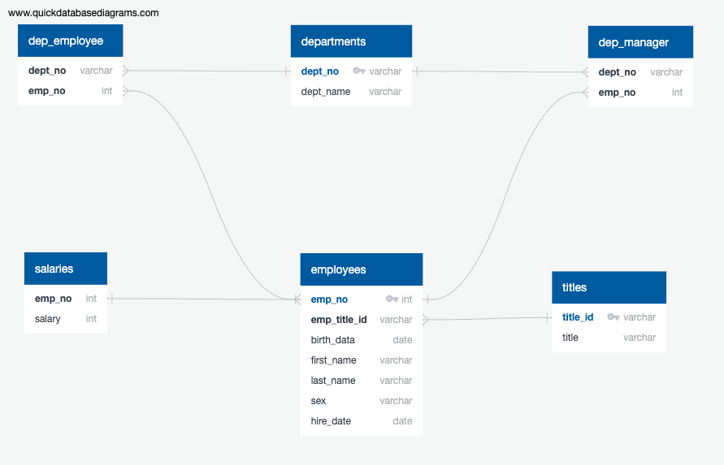

# SQL Homework - Employee Database: A Mystery in Two Parts

## Background

It is a beautiful spring day, and it is two weeks since you have been hired as a new data engineer at Pewlett Hackard. Your first major task is a research project on employees of the corporation from the 1980s and 1990s. All that remain of the database of employees from that period are six CSV files.

Through this assignment we created an ER diagram and data modeled the cvs files to query and analyse the data throug SQL and Python libraries. 

#### ER Diagram

Sketched out an ER diagram using http://www.quickdatabasediagrams.com

#### Data Engineering

* Specification of data types, primary keys, foreign keys, and other constraints.

* CSVs files where imported into SQL tables.

* Created Postgrades Data Base.

#### Data Analysis

1. List the following details of each employee: employee number, last name, first name, sex, and salary.

2. List first name, last name, and hire date for employees who were hired in 1986.

3. List the manager of each department with the following information: department number, department name, the manager's employee number, last name, first name.

4. List the department of each employee with the following information: employee number, last name, first name, and department name.

5. List first name, last name, and sex for employees whose first name is "Hercules" and last names begin with "B."

6. List all employees in the Sales department, including their employee number, last name, first name, and department name.

7. List all employees in the Sales and Development departments, including their employee number, last name, first name, and department name.

8. In descending order, list the frequency count of employee last names, i.e., how many employees share each last name.

## Bonus (Optional)

* Imported the SQL database into Pandas. 

* Created a histogram to visualize the most common salary ranges for employees.

* Created a bar chart of average salary by title.

## Submission

* Create an image file of your ERD.

* Create a `.sql` file of your table schemata.

* Create a `.sql` file of your queries.

* (Optional) Create a Jupyter Notebook of the bonus analysis.

* Create and upload a repository with the above files to GitHub and post a link on BootCamp Spot.

* Ensure your repository has regular commits and a thorough README.md file

